这是一篇科普文，目的是介绍车辆环视鸟瞰图的原理，并给出一份具体的 Python 实现。本文内容比较初等，只需要读者了解相机的标定、透视变换等知识，并懂得如何使用 OpenCV。

本文使用的全部代码和素材都放在 [github](https://github.com/neozhaoliang/surround-view-system-introduction) 上。

<!--more-->


首先上效果视频：

<video style="margin:0px auto;display:block" width=400 src="./car.mp4" controls></video><br/>


这个视频演示中使用的是一辆无人小车，车上搭载了四个环视鱼眼摄像头，相机拍摄到的画面首先经过畸变校正，然后在射影变换下转换为对地面的鸟瞰图，最后拼接起来经过平滑处理后得到了上面的效果。代码是纯 Python 实现的，运行在一台 AGX Xavier 上。相机传回的画面分辨率为 640x480，完全在 CPU 中进行处理，视频效果是实时的，非常流畅。


下面就来一一介绍我的实现步骤。这个实现很粗糙，仅作为一个演示项目展示全景鸟瞰图的生成流程，大家领会精神即可。但是运行效率和实时效果是完全可以媲美市面上的商用车搭载的产品的 (至少在 demo 里如此)。我在安装了环视系统的乘用车上也测试过这个程序，效果是一致的。


# 硬件和软件配置

介绍一下我们这个项目使用的硬件配置：

1. 四个 USB 鱼眼相机，支持的分辨率为 640x480|800x600|1920x1080 三种。我这里因为是需要在 Python 下面实时运行，为了效率考虑设置的分辨率是 640x480。

2. 一台小车，这个无需多言。

3. 一台 AGX Xavier。实际上这个程序在普通笔记本上跑一样溜得飞起。

软件配置如下：

1. 操作系统 Ubuntu 16.04.
2. Python>=3.
3. OpenCV2.7 (这个项目要用到 OpenCV 的线段检测，此功能在 OpenCV>=3 的某些版本中不可用).

四个相机分别安装在车辆四周，通过 USB 与 AGX 连接。

> **注意**：为了方便起见，在本文以及演示代码中，四个相机分别用 `front`、`back`、`left`、`right` 来指代，并假定其对应的 USB 设备号分别为 0, 1, 2, 3。实际开发中，每个摄像头分配的设备号与上电顺序有关，请针对具体情况进行修改。如果是 gmsl 摄像头则无须担心。


# 准备工作：获得原始图像与相机内参

首先我们需要获取每个相机的内参矩阵与畸变系数。我在项目中附上了一个脚本 [calibrate_camera.py](https://github.com/neozhaoliang/surround-view-system-introduction/blob/master/calibrate_camera.py)，你只需要运行这个脚本，通过命令行参数告诉它相机设备号，是否是鱼眼相机，以及标定板的网格大小，然后手举标定板在相机面前摆几个姿势即可。标定的结果会保存在 `yaml` 子目录的一个 `yaml` 文件中。我们约定 `K` 表示相机的 3x3 内参矩阵，`D` 表示相机的四个畸变系数。

以下是视频中四个相机分别拍摄的原始画面，顺序依次为前、后、左、右，并命名为 `front.png`、`back.png`、`left.png`、`right.png`。


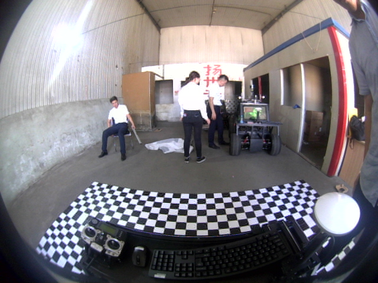
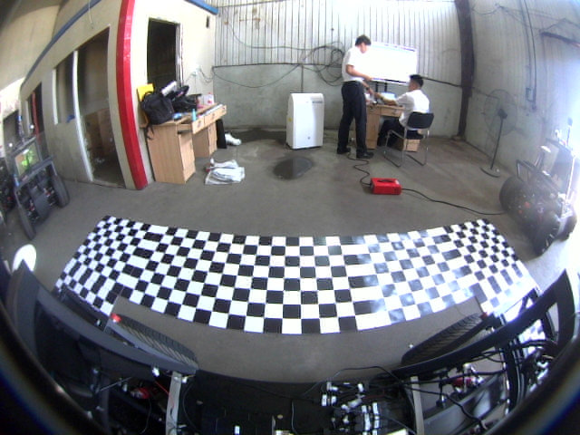
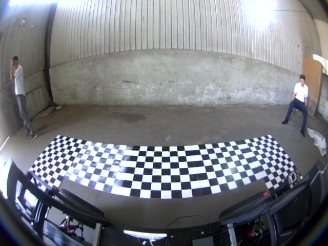

四个相机的内参文件分别为 `front.yaml`、`back.yaml`、`left.yaml`、`right.yaml`，这些图像和内参文件都存放在项目的 [yaml](https://github.com/neozhaoliang/surround-view-system-introduction/tree/master/yaml) 子目录下。

项目中还附上了辅助一个脚本 [show_undistorted_cameras.py](https://github.com/neozhaoliang/surround-view-system-introduction/blob/master/show_undistorted_cameras.py)，可以同时显示四个环视相机校正后的画面及其对应的设备号，便于查看校正效果以及相机与设备号的对应关系。


# 设置投影范围和参数


接下来我们需要获取每个相机到地面的投影矩阵，这个投影矩阵会把相机校正后的画面转换为对地面上某个矩形区域的鸟瞰图。这四个相机的投影矩阵不是独立的，它们必须保证投影后的区域能够正好拼起来。

这一步是通过联合标定实现的。即在车的四周地面上摆放标定板，拍摄图像，手动选取对应点，然后获取投影矩阵。

请看下图：


首先在车身的四角摆放四个标定板，标定板的图案大小并无特殊要求，只要尺寸一致，能在图像中清晰看到即可。每个标定板应当恰好位于相邻的两个相机视野的重合区域中。

在上面拍摄的相机画面中车的四周铺了一圈标定板，这个当时是主要为了保证摆放整齐，实际上四块就够了。

然后我们需要设置几个参数：(以下所有参数均以厘米为单位)

+ `chessboardSize`：标定板的尺寸。我们这里用的是 80x80 的泡沫板。
+ `innerShiftWidth`, `innerShiftHeight`：标定板内侧边缘与车辆左右两侧的距离，标定板内侧边缘与车辆前后方的距离。
+ `carWidth`, `carHeight`：标定板的左右间隔，标定板的前后间隔。这个尺寸等于车的宽度/高度加上二倍的 `innerShiftWidth` / `innerShiftHeight`。
+ `shiftWidth`, `shiftHeight`：这两个参数主要决定了在鸟瞰图中，向标定板的外侧看多远。这两个值越大，鸟瞰图看的范围就越大，相应地远处的物体被投影后的形变也越严重，所以应酌情选择。

于是鸟瞰图的总宽为

``` 
totalWidth = carWidth + 2 * chessboardSize + 2 * shiftWidth
```
总高为
```
totalHeight = carHeight + 2 * chessboardSize｀ + 2 * shiftHeight
```

我在图中还标注了车辆所在矩形区域的四角 (红色圆点)，这四个角点的坐标分别为 $(x_1,y_1), (x_2,y_1), (x_1,y_2),(x_2,y_2)$。这个矩形区域相机是看不到的，我们会用一张车辆的 logo 图像来覆盖此处。

注意这个车辆区域四边的延长线将整个鸟瞰图分为前左 (FL)、前中 (F)、前右 (FR)、左 (L)、右 (R)、后左 (BL)、后中 (B)、后右 (BR) 八个部分，其中 FL、FR、BL、BR 是相邻相机视野的重合区域，也是我们重点需要进行融合处理的部分。F、R、L、R 四个区域属于每个相机单独的视野，不需要进行融合处理。

以上参数存放在 [paramsettings.py](https://github.com/neozhaoliang/surround-view-system-introduction/blob/master/paramsettings.py) 中。

设置好参数以后，每个相机的投影区域也就确定了，比如前方相机对应的投影区域如下：

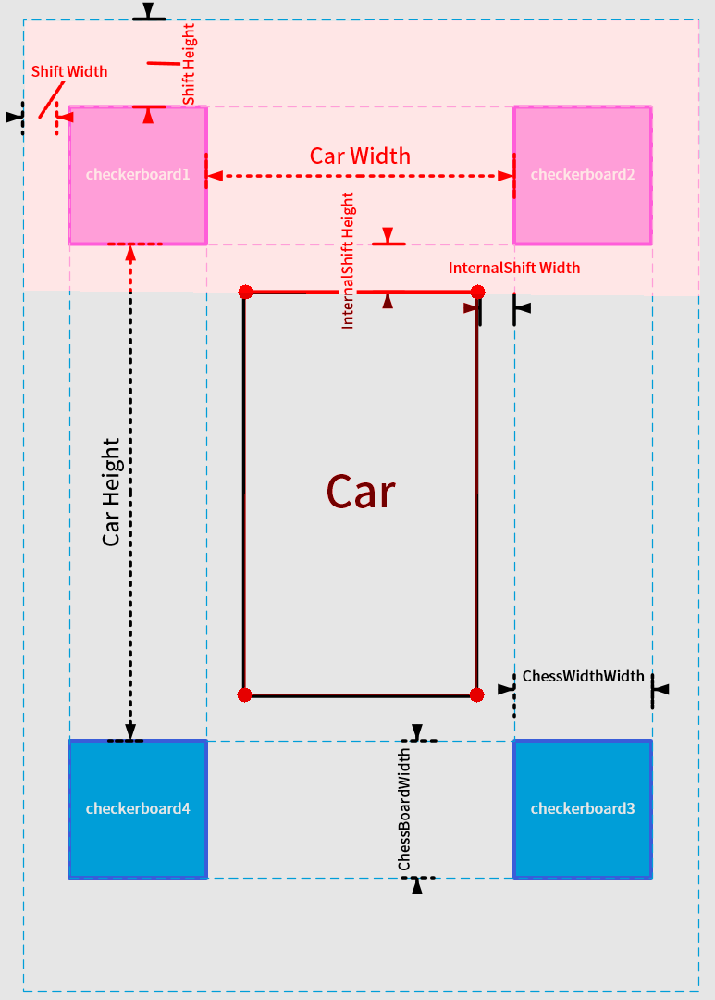

接下来我们需要通过手动选取标志点来获取到地面的投影矩阵。


# 手动标定获取投影矩阵

首先运行项目中 [get_projection_maps.py](https://github.com/neozhaoliang/surround-view-system-introduction/blob/master/get_projection_maps.py) 这个脚本，这个脚本会首先显示相机图像校正后的画面：

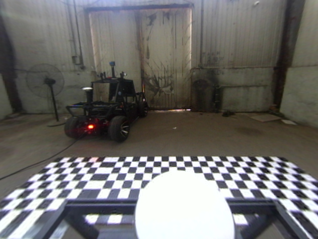

> **注意**：默认的 OpenCV 的校正函数会将鱼眼相机校正后的画面进行裁剪，返回一个 OpenCV "认为" 合适的区域，但是这可能会导致我们拍摄的标定板的某些部分被裁剪掉。幸运的是 [cv2.fisheye.initUndistortRectifyMap](https://docs.opencv.org/master/db/d58/group__calib3d__fisheye.html#ga0d37b45f780b32f63ed19c21aa9fd333) 这个函数允许我们再传入一个新的内参矩阵，对校正后的画面再作一次放缩和平移。你可以对每个相机选择不同的横向、纵向压缩比。
>
> 在这个项目中，我没有采用这一方法，但代码中预留了 `scale_x`, `scale_y` 作为接口，你可以修改这两个值来调整校正后图像显示的范围。

然后依次点击事先确定好的四个标志点 (顺序不能错！)，得到的效果如下：

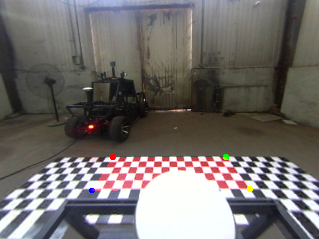

这四个标志点是可以自由设置的，但是你需要在程序中手动修改它们在鸟瞰图中的像素坐标。当你在校正图中点击这四个点时，OpenCV 会根据它们在校正图中的像素坐标和在鸟瞰图中的像素坐标的对应关系计算一个射影矩阵。这里用到的原理就是四点对应确定一个射影变换。

如果你不小心点歪了的话可以按 `d` 键删除上一个错误的点。选择好以后点回车，就会显示投影后的效果图：

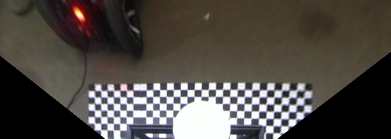

再点击 `q` 键退出，就会将投影矩阵写入 `front.yaml` 中，这个矩阵的名字为 `M`。

有黑色区域看不到？没关系，左右两边相机的鸟瞰图会把它们补上的。

再比如左侧相机的标定如下图所示：

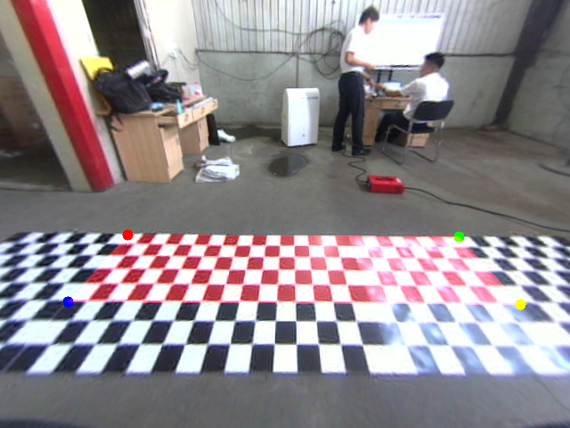

对应的投影图为

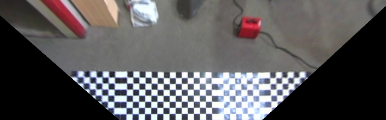

对四个相机分别采用此操作，我们就得到了四个相机的鸟瞰图，以及对应的四个投影矩阵。下一步我们的任务是把这四个鸟瞰图拼起来。

# 鸟瞰图的拼接与平滑

如果你前面的操作一切正常的话，运行 [stitch_images.py](https://github.com/neozhaoliang/surround-view-system-introduction/blob/master/stitch_images.py) 后应该会显示如下的拼接图：


它是首先读取了四个相机的原始图像和四个 `yaml` 文件，将画面校正后投影到地面，然后拼接在一起并进行平滑处理得到的。

我来逐步介绍它是怎么做到的：

1. 由于相邻相机之间有重叠的区域，所以这部分的融合是关键。如果直接采取两幅图像加权平均的方式融合的话你会得到类似下面的结果：

    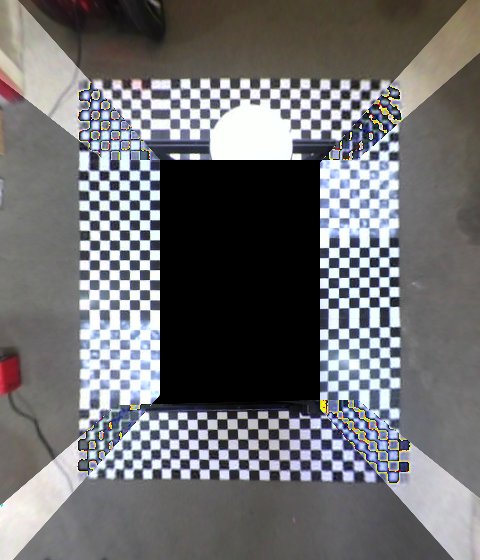

    这里的关键在于权重系数应该是随像素变化而变化的，并且是随着像素连续变化。
    
2. 以左上角区域为例，这个区域是 `front`, `left` 两个相机视野的重叠区域。我们首先将投影图中的重叠部分取出来：

    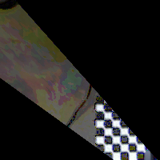

    灰度化：
    
    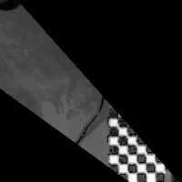

    二值化：
    
    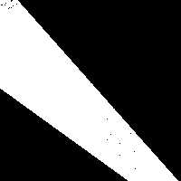

    注意这里面有噪点，可以用形态学操作去掉：
    
    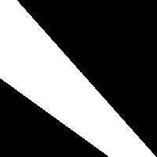
    
    至此我们就得到了重叠区域的一个完整 mask。

3. 将重叠区域的边界上的两条线段检测出来：(只取最长的这两条，在投影标定时必须调整 `scale_x|scale_y` 使得重叠区域的边界有如下的形状，这是这个方法的一个限制)
   
    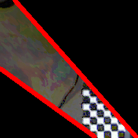

    这里用到了 OpenCV 的 `cv2.createLineSegmentDetector`，此功能在 OpenCV>=3 中被移除了。

4. 对重叠区域中的每个像素，计算其到这两个线段的距离 $d_1, d_2$，则该像素对应的权值为 $w=d_1^2/(d_1^2+d_2^2)$ 和 $1-w$。

5. 对不在重叠区域内的像素，若其属于 `front` 相机的范围则其权值为 1，否则权值为 0。于是我们得到了一个连续变化的，取值范围在 0~1 之间的矩阵 $G$，其灰度图如下：
    
    

    用 $G$ 作为权值融合即可得到平滑的鸟瞰图。
    
6. 最后还有重要的一步：由于不同相机的曝光度不同，导致不同的区域会出现明暗的亮度差，影响美观。我们需要调整每个区域的亮度，使得整个拼接图像的亮度趋于一致。这一步可以通过给拼接图像的 RGB 通道分别乘以一个常数来实现，这三个常数是这样计算的：对四个重叠区域 FL、FR、BL、BR，分别计算两个相邻相机 $A, B$ 在此区域的 RGB 通道平均值 $(A_r,A_g,A_b)$ 和 $(B_r, B_g,B_b)$，然后分别求比值得到三个比 $(A_r/B_r,A_g/B_g, A_b/B_b)$。对四个重叠区域我们可以得到四组比值：
    
    1. 右/前： $(a_1,a_2,a_3)$
    2. 后/右： $(b_1,b_2,b_3)$
    3. 左/后： $(c_1,c_2,c_3)$
    4. 前/左： $(d_1,d_2,d_3)$

    定义 $$\begin{align*}e_1&=(a_1 + b_1 + c_1 + d_1) / (a_1^2 + b_1^2 + c_1^2 + d_1^2),\\
    e_2 &= (a_2 + b_2 + c_2 + d_2) / (a_2^2 + b_2^2 + c_2^2 + d_2^2),\\
    e_3 &= (a_3 + b_3 + c_3 + d_3) / (a_3^2 + b_3^2 + c_3^2 + d_3^2).\end{align*}$$

    分别乘在拼接图的 RGB 三个通道上即可。
    

这个调整亮度差的方法我是从一篇文章上看到的，但是出处不记得了。


# 具体实现的注意事项

本文介绍的只是一个类似 "课程作业" 性质的实现，距离正式成为商业产品还有不少工作要做：

1. 标定流程应当界面化、自动化。
2. 重叠区域的融合算法需要改进，这里用的是一个 "土味" 很重的方法。
3. 亮度调整的方法也有值得改进之处。当车辆两侧环境一边黑暗一边光明时仍然会出现亮度差。
4. 最终我们还需要实现一个 lookup table，中间这些校正、投影、拼接流程只在标定时用一次即可，运行时完全可以通过 lookup table 和权重矩阵直接获得鸟瞰图。

至于其它的如图像同步、缓冲设计、多线程就不说了。

# 实车运行

你可以在实车上运行 [surroundview.py](https://github.com/neozhaoliang/surround-view-system-introduction/blob/master/surroundview.py) 来验证最终的效果。


# 附录：项目各脚本一览

项目中目前的脚本根据执行顺序排列如下：

1. `calibrate_camera.py`：用于相机内参标定。
2. `show_undistorted_cameras.py`：用于显示校正后的画面和查看设备号与相机对应关系。
3. `paramsettings.py`：用于设置投影区域的各参数。
4. `get_projection_maps.py`：用于手动标定获取到地面的投影矩阵。
5. `stitch_images.py`：用于显示静态的鸟瞰图拼接效果。
6. `surroundview.py`：用于在实车上运行的最终版本。
