This project is a simple, runnable, and reproducible demo to show how to develop a surround-view system in Python.

It contains all the key steps: camera calibration, image stitching, and real-time processing.

This project was originally developed on a small car with an AGX Xavier and four USB fisheye cameras：(see `img/smallcar.mp4`)

<video style="margin:0px auto;display:block" width=400 src="./img/smallcar.mp4" controls></video>

The camera resolution was set to 640x480, everything was done in Python.

Later I improved the project and migrated it to a [EU5 car](https://en.wikipedia.org/wiki/Beijing_U5), still processing in a Xavier AGX, and got a better result: (see `img/car.mp4`)

<video style="margin:0px auto;display:block" width=400 src="./img/car.mp4" controls></video>

This EU5 car version used the four CSI cameras of resolution 960x640. The full review image has a resolution 1200x1600, the fps is about 17/7 without/with post-precessing, respectively.


> **Remark**：The black area in front of the car is the blind area after projection, it's because the front camera wasn't installed correctly.

The project is not very complex, but it does involve some careful computations. Now we explain the whole process step by step.


# Hardware and software

The hardware I used in the small car project is:

1. Four USB fisheye cameras, supporting three different modes of resolution: 640x480|800x600|1920x1080. I used 640x480 because it suffices for a car of this size.
2. AGX Xavier.

Indeed you can do all the development on your laptop, an AGX is not a strict prerequisite to reproduce this project.

The hardware I used in the EU5 car project is:

1. Four CSI cameras of resolution 960x640。I used Sekonix's [SF3326-100-RCCB camera](http://sekolab.com/products/camera/).
2. Also, AGX Xavier is the same as in the small car.

The software:

1. Ubuntu 16.04/18.04.
2. Python>=3.
3. OpenCV>=3.
4. PyQt5.

`PyQt5` is used mainly for multi-threading.


# Conventions

The four cameras will be named `front`、`back`、`left`、`right`，and with device numbers 0, 1, 2, and 3, respectively. Please modify this according to your actual device numbers.

The camera intrinsic matrix is denoted as `camera_matrix`， this is a 3x3 matrix.
The distorted coefficients are stored in `dist_coeffs`, this is a 1x4 vector.
The projection matrix is denoted as `project_matrix`， this is a 3x3 projective matrix.


# Prepare work: camera calibration


There is a script [run_calibrate_camera.py](https://github.com/neozhaoliang/surround-view-system-introduction/blob/master/run_calibrate_camera.py) in this project to help
 you calibrate the camera. I'm not going to discuss how to calibrate a camera here, as there are lots of resources on the web.
 
Below are the images taken by the four cameras, in the order `front.png`、`back.png`、`left.png`、`right.png`, they are in the `images/` directory.

| |  |   |   |
|:-:|:-:|:-:|:-:|
|front|back|left|right|
||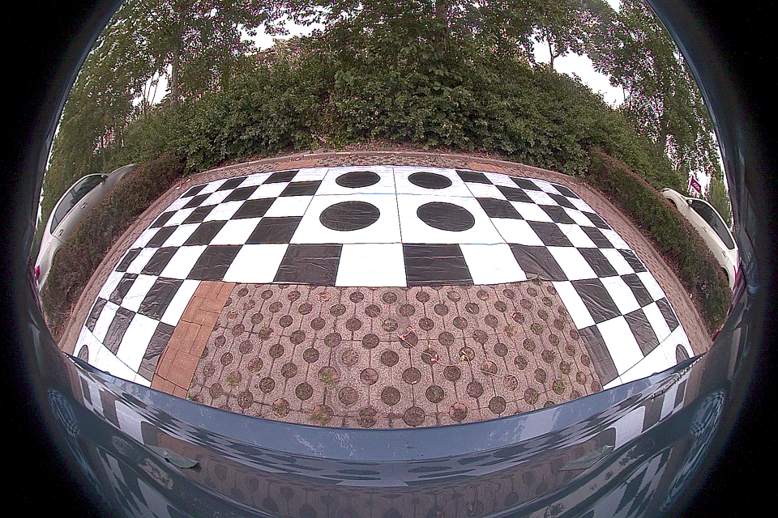|||

The parameters of these cameras are stored in the yaml files `front.yaml`、`back.yaml`、`left.yaml`、`right.yaml`, these files can be found in the [yaml](https://github.com/neozhaoliang/surround-view-system-introduction/tree/master/yaml) directory.

You can see there is a black-white calibration pattern on the ground, the size of the pattern is `6mx10m`, the size of each black/white square is `40cmx40cm`, the size of each square with a circle in it is `80cmx80cm`.


# Setting projection parameters


Now we compute the projection matrix for each camera. This matrix will transform the undistorted image into a bird's view of the ground. All four projection matrices must fit together to make sure the four projected images can be stitched together.

This is done by putting calibration patterns on the ground, taking the camera images, manually choosing the feature points, and then computing the matrix.

See the illustration below:


Firstly you put four calibration boards at the four corners around the car (the blue squares). There are no particular restrictions on how large the board must be, only make sure you can see it clearly in the image.

OF course, each board must be seen by the two adjacent cameras.

Now we need to set a few parameters: (in `cm` units)

+ `innerShiftWidth`, `innerShiftHeight`：distance between the inner edges of the left/right calibration boards and the car， the distance between the inner edges of the front/back calibration boards and the car。
+ `shiftWidth`, `shiftHeight`：How far you will want to look at out of the boards. The bigger these values, the larger the area the birdview image will cover.
+ `totalWidth`, `totalHeight`：Size of the area that the birdview image covers. In this project, the calibration pattern is of width `600cm` and height `1000cm`, hence the bird view image will cover an area of size `(600 + 2 * shiftWidth, 1000 + 2 * shiftHeight)`. For simplicity,
we let each pixel correspond to 1cm, so the final bird-view image also has a resolution

    ``` 
    totalWidth = 600 + 2 * shiftWidth
    totalHeight = 1000 + 2 * shiftHeight
    ```

+ The four corners of the rectangular area where the vehicle is located (marked with red dots in the image) are denoted by the coordinates (xl, yt), (xr, yt), (xl, yb), and (xr, yb), where "l" stands for left, "r" stands for right, "t" stands for top, and "b" stands for bottom. The camera cannot see this rectangular area, and we will use an icon of the vehicle to cover it.

Note that the extension lines of the four sides of the vehicle area divide the entire bird's-eye view into eight parts: front-left (FL), front-center (F), front-right (FR), left (L), right (R), back-left (BL), back-center (B), and back-right (BR). Among them, FL (area I), FR (area II), BL (area III), and BR (area IV) are the overlapping areas of adjacent camera views, and they are the parts that we need to focus on for fusion processing. The areas F, R, L, and R belong to the individual views of each camera and do not require fusion processing.

The above parameters are saved in [param_settings.py](https://github.com/neozhaoliang/surround-view-system-introduction/blob/master/surround_view/param_settings.py) 


Once the parameters are set, the projection area for each camera is determined. For example, the projection area for the front camera is as follows:


Next, we need to manually select the feature points to obtain the projection matrix for the ground plane.


# Manually select feature points for the projection matrix


Firstly you need to run this script, [run_get_projection_maps.py](https://github.com/neozhaoliang/surround-view-system-introduction/blob/master/run_get_projection_maps.py), with the following parameters：

+ `-camera`: specify the camera (left, right, front, rear)
+ `-scale`: The horizontal and vertical scaling ratios of the corrected image after undistortion
+ `-shift`: The horizontal and vertical distances of the corrected image center after undistortion。


The scale and shift parameters are needed because the default OpenCV calibration method for fisheye cameras involves cropping the corrected image to a region that OpenCV "thinks" is appropriate. This inevitably results in the loss of some pixels, especially the feature points that we may want to select.

Fortunately, the function [`cv2.fisheye.initUndistortRectifyMap`](https://docs.opencv.org/master/db/d58/group__calib3d__fisheye.html#ga0d37b45f780b32f63ed19c21aa9fd333) allows us to provide a new intrinsic matrix, which can be used to perform a scaling and translation of the un-cropped corrected image. By adjusting the horizontal and vertical scaling ratios and the position of the image center, we can ensure that the feature points on the ground plane appear in comfortable places in the image, making it easier to perform calibration.


```bash
python run_get_projection_maps.py -camera front -scale 0.7 0.8 -shift -150 -100
```

The undistorted image of the front camera：

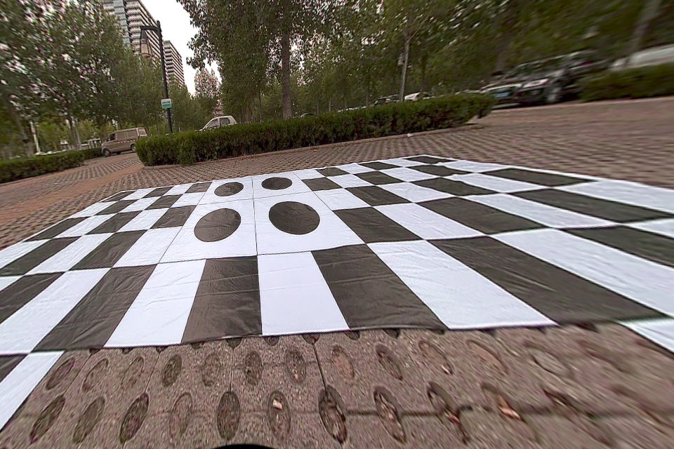

Then, click on the four predetermined feature points in order (the order cannot be wrong!), and the result will look like this:

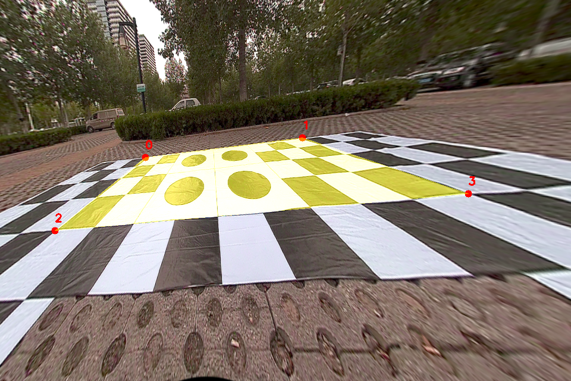

The script for setting up the points is [here](https://github.com/neozhaoliang/surround-view-system-introduction/blob/master/surround_view/param_settings.py#L40)。

These four points can be freely set, but you need to manually modify their pixel coordinates in the bird's-eye view in the program. When you click on these four points in the corrected image, OpenCV will calculate a perspective transformation matrix based on the correspondence between their pixel coordinates in the corrected image and their corresponding coordinates in the bird view. The principle used here is that a perspective transformation can be uniquely determined by four corresponding points (four points can give eight equations, from which the eight unknowns in the perspective matrix can be solved. Note that the last component of the perspective matrix is always fixed to 1).

If you accidentally click the wrong point, you can press the d key to delete the last selected point. After selecting the four points, press Enter, and the program will display the resulting bird's-eye view image:

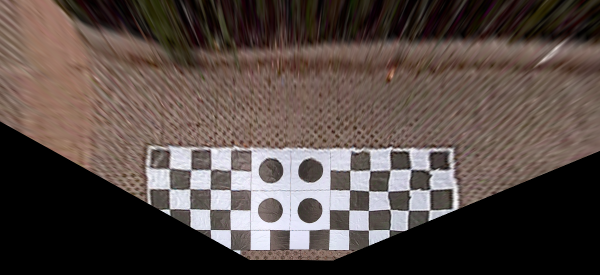

If you are satisfied with the result, press the Enter key to write the projection matrix to the front.yaml file. The name of the matrix is project_matrix. If you are not satisfied, press 'q' to exit and start over.

The four points of the rear camera image：

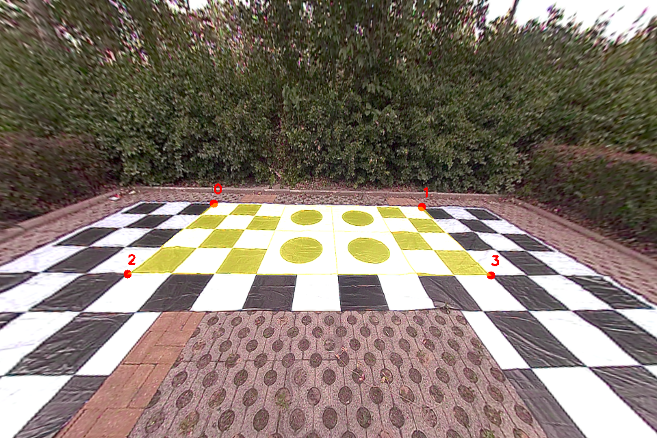

The corresponding undistorted image:

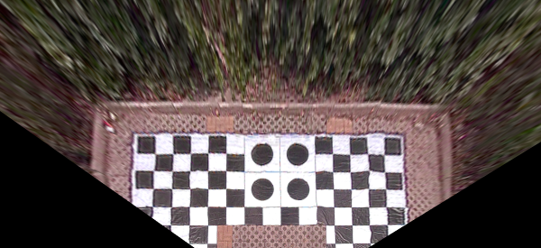

We will stitch the four bird's-eye view images together using the same procedure and get their projection matrix respectively.

> **Important**: It is crucial to select four points that cover as largest possible area in the image to ensure seamless stitching. Failure to do so may result in poor stitching. Despite being called as undistorted, the image may still contain distortions due to various errors in the undistortion process, particularly noticeable towards the image periphery. Therefore, we should ask OpenCV to find a globally optimized projective matrix by leveraging information from a broader image area, rather than relying solely on local and limited regions.


# Stitching and smoothing of the birdseye view image


If everything goes well from the previous section, and after executing this script: [run_get_weight_matrices.py](https://github.com/neozhaoliang/surround-view-system-introduction/blob/master/run_get_weight_matrices.py), you will notice the stitched birdseye view image：

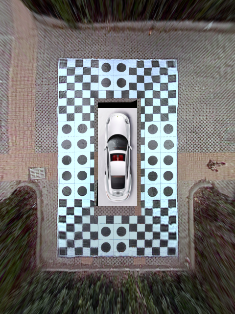

The logic behind this script is as follows：

1. Due to the overlapping areas between adjacent cameras, the fusion of these overlapping parts is crucial for this task. If we directly use a simple weighted averaging approach with weights of 0.5 for each image, we would observe the output like the following image:

    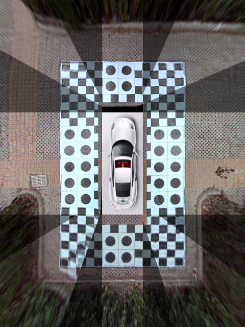
    
You can see that due to the errors in calibration and projection, the projected results of adjacent cameras in the overlapping area do not match perfectly, resulting in garbled and ghosting effects in the stitched image. The key point is the weighting coefficients which should vary with the pixels and change continuously with them.
    
2. Let's take the upper-left corner as an example, which is the overlapping area of the front and left cameras. We first extract the overlapping area from the projected images:

    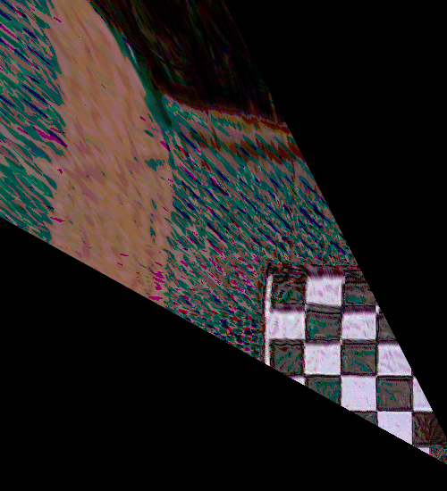

    grayscale and thresholding：
    
    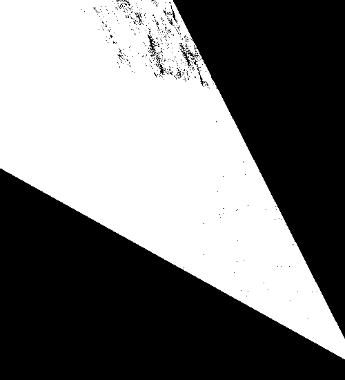

    We can use morphological operations to remove the noise (it doesn't need to be very precise, rough removal is enough):
    
    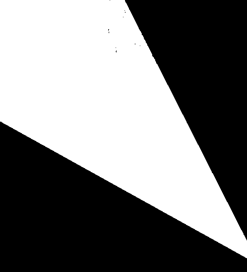
    
    Then we have the mask for this overlapping area。

3. To obtain the outer boundaries of the front and left images that lie outside the overlapping region, we first use cv2.findContours to find the outermost contour and then use cv2.approxPolyDP to obtain the approximated polygonal contour：
  
    |||
    |:-:|:-:|
    |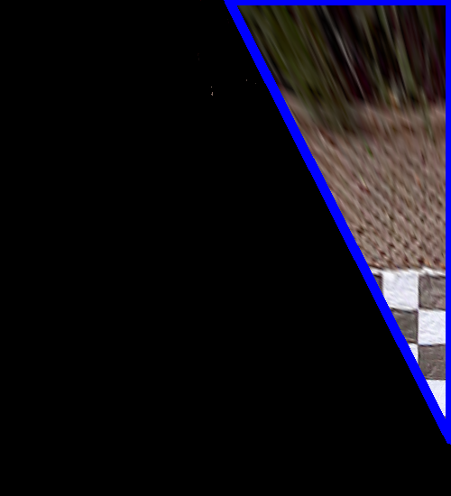|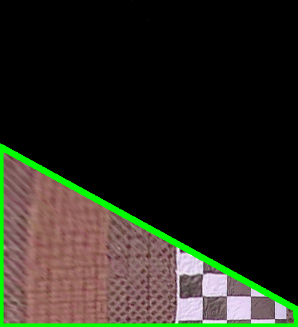|
    
    We denote the contour obtained by subtracting the overlapping region from the front camera as polyA (blue boundary in the top left image), and the contour obtained by subtracting the overlapping region from the left camera as polyB (green boundary in the top right image).

4. For each pixel in the overlapping area, we can calculate its distance to the two polygons polyA and polyB using cv2.pointPolygonTest, denoting the distances as $d_A$ and $d_B$, respectively. The weight of the pixel is then given by $w=d_B^2/(d_A^2+d_B^2)$. If the pixel falls inside the front image, then its distance to polyB will be greater, giving it a larger weight.

5. For each pixel in the overlapping region, we can use cv2.pointPolygonTest to calculate its distance to the two polygons polyA and polyB. Let $d_A$ and $d_B$ be the distances from the pixel to polyA and polyB, respectively. Then the weight of the pixel is calculated as $w=d_B^2/(d_A^2+d_B^2)$. This means that if the pixel is in the front camera view, it will have a larger weight if it is farther away from polyB. For pixels outside the overlapping region, their weight is 1 if they belong to the front camera's view, and 0 otherwise. Thus, we obtain a continuous matrix $G$ with values ranging between 0 and 1. Here is the grayscale image of $G$:

    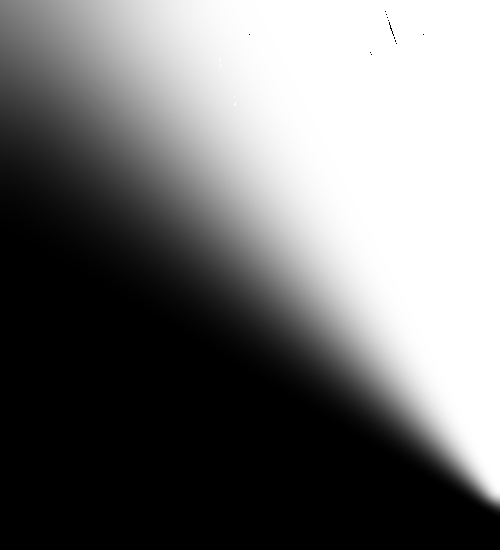
    
    By using $G$ as the weight matrix, we can get the fused image: `front * G + (1- G) * left`。

6. Please note that since the pixel values in the overlapping region are the weighted average of two images, there will inevitably be ghosting artifacts for objects in this region. Therefore, we need to minimize the size of the overlapping region as much as possible and only calculate the weight values for pixels around the stitching seam. We should use the original pixels from the front image as much as possible for the pixels above the seam and the original pixels from the back image for the pixels below the seam. This step can be achieved by controlling the value of $d_B$.
  
7. Due to the different exposure levels of different cameras, there will be brightness differences in different areas, which will affect the performance of the final stitched image. We need to adjust the brightness of each area to make the overall brightness of the stitched image tend to be consistent. And there is no unique method. After doing several searches online and then realized that the methods mentioned are either too complicated and computationally expensive or too simple and unable to achieve the ideal performance. In particular, in the example of the second video above, the field of view of the front camera is insufficient due to the obstruction of the car logo, resulting in a large difference in brightness between its image and the other three cameras, which is very difficult to adjust.
  
    One basic idea is as follows: Each camera returns an image with three channels in BGR format, and the four cameras together provide a total of 12 channels. We need to calculate 12 coefficients, which are then multiplied with each of the 12 channels, and then combined to form the adjusted image. Channels that are too bright need to be darkened, so the coefficients are less than 1, and channels that are too dark need to be brightened, so the coefficients are greater than 1. These coefficients can be obtained from the brightness ratio of the four images in their overlapping regions. You can design the method for calculating these coefficients as you wish as long as it satisfies this basic principle.

    Here is my [implementation](https://github.com/neozhaoliang/surround-view-system-introduction/blob/master/surround_view/birdview.py#L210).

    There is also another simple way to adjust the brightness, which is to pre-calculate a tone mapping function (such as piecewise linear or AES tone mapping function) and then force all pixels to be converted using this function. This method is the most simple one, but the color tone in the output frame may differ significantly from the actual environment.

8. The final step is color balance, which is needed in some cases where the intensity of different channels may vary between cameras. Please refer to the image below:
    
    |  |   |   |
    |:-:|:-:|:-:|
    |Raw frame after stitching| After white balance | After brightness and color balance|
    |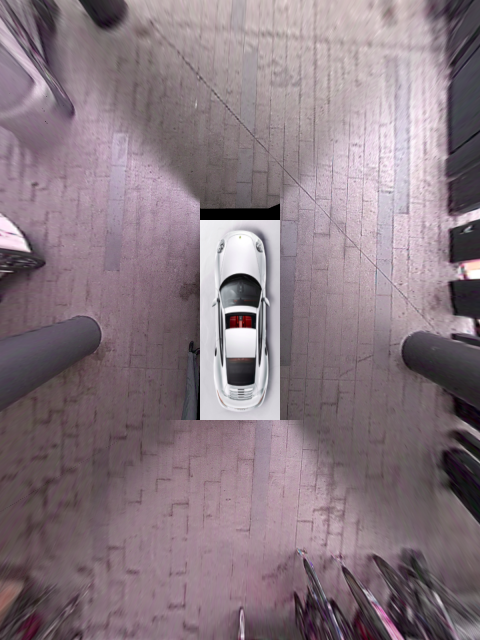|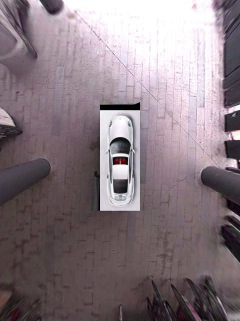|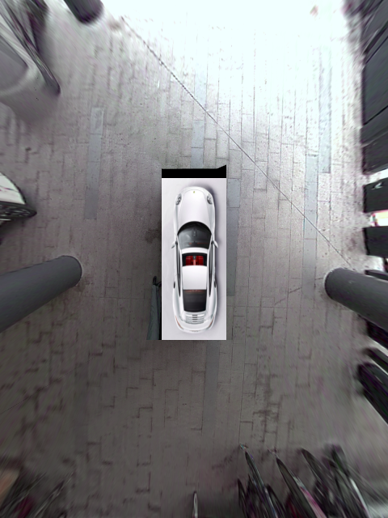|

    In the example of the second video, the image turns to be more red than normal. After applying color balancing, the image is back to normal.


# Attentions


1. Multi-threading and thread synchronization. In the two examples in this article, none of the four cameras are hardware-triggered for synchronization, and even if hardware synchronization is used, the processing threads of the four images may not be synchronized, so a thread synchronization mechanism is needed. The implementation of this project uses a relatively primitive method, and its core code is as follows:

```python
class MultiBufferManager(object):

    ...

    def sync(self, device_id):
        # only perform sync if enabled for specified device/stream
        self.mutex.lock()
        if device_id in self.sync_devices:
            # increment arrived count
            self.arrived += 1
            # we are the last to arrive: wake all waiting threads
            if self.do_sync and self.arrived == len(self.sync_devices):
                self.wc.wakeAll()
            # still waiting for other streams to arrive: wait
            else:
                self.wc.wait(self.mutex)
            # decrement arrived count
            self.arrived -= 1
        self.mutex.unlock()
```
Here, a MultiBufferManager object is used to manage all the threads. Each camera thread calls its sync method at each iteration and notifies the object by incrementing a counter, saying "report, I have completed the previous task, please put me in the sleep pool and wait for the next task." Once the counter reaches 4, all threads are awakened to enter the next round of task iteration.

2. Creating a lookup table can speed up the processing. To stitch images from fisheye lenses, the captured images need to go through calibration, projection, and flipping before they can be used for stitching. These three steps involve frequent memory allocation and deallocation, which is time-consuming. In our experiment, the capturing threads were stable at around 30 fps, but each processing thread is only about 20 fps. To speed up this processing, it's best to precompute a lookup table. For example, the cv2.fisheye.initUndistortRectifyMap returns two lookup tables, mapx and mapy, and when you specify the matrix type cv2.CV_16SC2, mapx returned is a per-pixel lookup table, and mapy is a one-dimensional array for interpolation smoothing (which can be discarded). Similarly, a lookup table can also be obtained for the project_matrix, and combining the two will give you a lookup table that directly maps the original image to the projected image (although losing information for interpolation). 

In this project, Python was used for implementation; however, the for loops in Python are not very efficient, this lookup table method was not used.

3. The four weight matrices can be compressed into a single image with four channels (RGBA), which is convenient for storage and retrieval. The same applied for the four overlapping mask matrices:

    

    


# On vehicle demo


You can run this algo on vehicle to test performance: [run_live_demo.py](https://github.com/neozhaoliang/surround-view-system-introduction/blob/master/run_live_demo.py)

But you need to specify the correct porf of the cameras. For USB camera, you can directly call `cv2.VideoCapture(i)` (`i` indicates the USB port for this camera)，for CSI camera, you need to use `gstreamer` , and here is the script [CSI camera scripts](https://github.com/neozhaoliang/surround-view-system-introduction/blob/master/surround_view/utils.py#L5) and [Capture thred](https://github.com/neozhaoliang/surround-view-system-introduction/blob/master/surround_view/capture_thread.py#L75)。


# Appendix: scripts in this repo and their description


The script squence of running this repo:

1. `run_calibrate_camera.py`：intrinsic matrix calibration
2. `param_settings.py`：set up projection matrix and related parameters
3. `run_get_projection_maps.py`：manually select projection points and area
4. `run_get_weight_matrices.py`：calculate the weight matrix and mask matrix for the four overlapping regions, and to display the stitching results。
6. `run_live_demo.py`：on vehicle demo。
